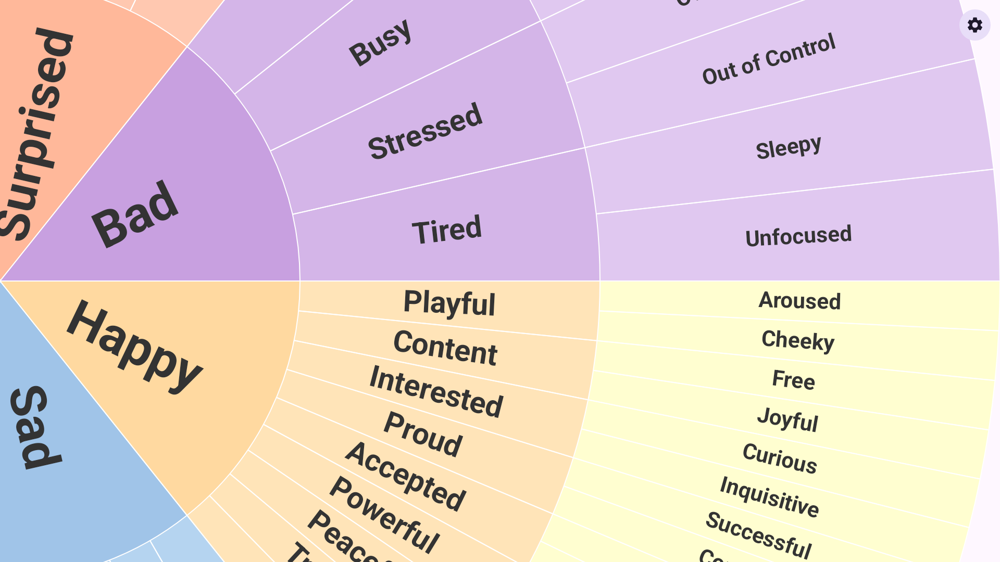

# Feelings Wheel

Name your feelings with a beautiful, interactive emotion wheel.

## About

Feelings Wheel helps you identify and name your emotions using a beautiful, interactive wheel. Spin, explore, and tap through three layers of feelings — from broad emotions at the center to precise words at the edges.

**Three layers of emotions**
- **Core** — 7 broad feelings: Happy, Sad, Angry, Fearful, Disgusted, Surprised, Bad
- **Middle** — ~41 more specific emotions like Playful, Lonely, or Insecure
- **Outer** — ~82 precise words like Cheeky, Isolated, or Inadequate

Tap any segment to see the full path — like **Happy → Playful → Cheeky** — helping you pinpoint exactly what you're experiencing.

**Multi-language support** — Available in English and Thai (ภาษาไทย).

**Color palettes** — Choose between Classic (bold, saturated) and Pastel (soft, muted) color schemes.

**Landscape support** — Works beautifully in both portrait and landscape orientation.

**100% private and offline.** No internet connection, no data collection, no ads, no accounts, no permissions. Your emotions stay on your device.

Perfect for journaling, therapy, mindfulness, or building emotional awareness.

## Screenshots

### Phone

<p align="center">
  &nbsp;&nbsp;
  
</p>

### Tablet

<p align="center">
  
</p>

## Install

**Google Play Store:** [Download on Google Play](https://play.google.com/store/apps/details?id=com.nuttyknot.feelingswheel)

**Build from source:** See [Technical Details](#technical-details) below.

<details>
<summary><h2>Technical Details</h2></summary>

### Architecture

Single-activity Android app built with Kotlin and Jetpack Compose (Material 3). Package: `com.nuttyknot.feelingswheel`, minSdk 26, targetSdk 35.

- **Data layer** — `CoreEmotion` enum (7 emotions), swappable `WheelPalette` (Classic/Pastel) with `EmotionColors`, localized `EmotionHierarchy` (English/Thai) via `HierarchyProvider`, `SettingsRepository` (DataStore-backed persistence for palette, language, onboarding)
- **ViewModel** — `FeelingsWheelViewModel` holds UI state via `StateFlow`; observes settings and rebuilds segments on palette/language change; handles segment selection, onboarding, and settings updates
- **UI** — Canvas-based semi-circle wheel with drag-to-rotate (fling with `exponentialDecay`), tap-to-select via hit testing, animated selection panel, navigation (`AppNavHost` with wheel/settings routes), settings screen, and app footer

### Requirements

- Android Studio Ladybug or later
- JDK 17
- Android SDK 35

### Build & Run

```bash
./gradlew assembleDebug       # Build debug APK
./gradlew installDebug        # Build + install (also runs ktlintCheck, lintDebug, detekt)
```

### Testing

Screenshot tests use [Paparazzi](https://github.com/cashapp/paparazzi) (no device or emulator needed):

```bash
./gradlew testDebugUnitTest        # Run all unit tests
./gradlew recordPaparazziDebug     # Record golden screenshots
./gradlew verifyPaparazziDebug     # Verify against golden screenshots
```

### Linting

```bash
./gradlew ktlintFormat        # Auto-format Kotlin files
./gradlew ktlintCheck         # Check formatting
./gradlew detekt              # Static analysis (config: detekt.yml)
```

A pre-commit hook (`scripts/pre-commit`) runs `ktlintFormat` and `detekt` automatically on every commit.

</details>

## Privacy Policy

This app collects no data. See [PRIVACY_POLICY.md](PRIVACY_POLICY.md) for details.

## License

[MIT](LICENSE) — Copyright (c) 2026 Tiratat Patana-anake
