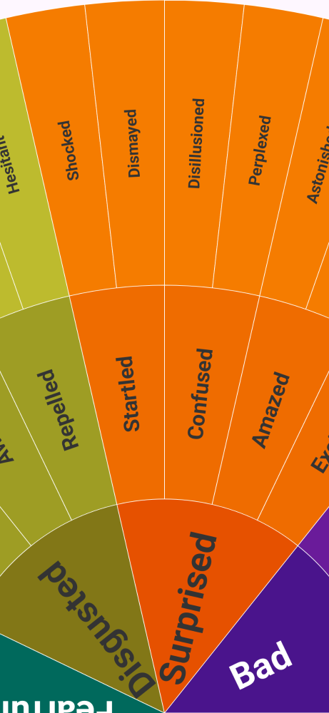
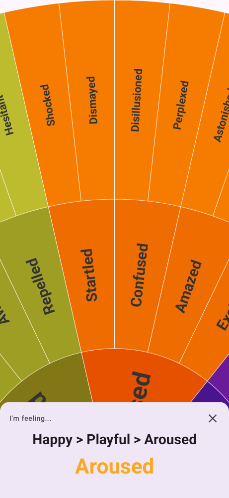

# Feelings Wheel

Name your feelings with a beautiful, interactive emotion wheel.

## About

Feelings Wheel helps you put words to what you're feeling. It displays an interactive wheel of emotions organized in three layers — from broad feelings at the center to specific emotions at the edges.

Spin the wheel, then tap any segment to explore your emotions. The app shows you a path from general to specific, like **Happy > Playful > Cheeky**, helping you pinpoint exactly what you're experiencing.

The wheel covers over 130 emotions across three rings:

- **Core** — 7 broad emotions like Happy, Sad, Angry, and Fearful
- **Middle** — more specific feelings like Playful, Lonely, or Insecure
- **Outer** — precise emotions like Cheeky, Isolated, or Inadequate

Whether you're journaling, in therapy, practicing mindfulness, or just building emotional awareness, Feelings Wheel gives you the vocabulary to express how you feel.

**Your privacy is respected.** The app works entirely offline — no internet connection, no data collection, no ads, no accounts, no permissions required. Your emotions stay on your device and nowhere else.

## Screenshots

<p align="center">
  &nbsp;&nbsp;
  
</p>

## Install

**Google Play Store:** [Coming soon](#)

**Build from source:** See [Technical Details](#technical-details) below.

<details>
<summary><h2>Technical Details</h2></summary>

### Architecture

Single-activity Android app built with Kotlin and Jetpack Compose (Material 3). Package: `com.nuttyknot.feelingswheel`, minSdk 26, targetSdk 35.

- **Data layer** — `CoreEmotion` enum (7 emotions with per-layer colors), hierarchical `MiddleEmotion`/`OuterEmotion` types, and `EmotionData` which computes arc segments by dividing 360° equally
- **ViewModel** — `FeelingsWheelViewModel` holds UI state via `StateFlow`; handles segment selection with breadcrumb path
- **UI** — Canvas-based semi-circle wheel with drag-to-rotate (fling with `exponentialDecay`), tap-to-select via hit testing, and an animated selection panel

### Requirements

- Android Studio Ladybug or later
- JDK 17
- Android SDK 35

### Build & Run

```bash
./gradlew assembleDebug       # Build debug APK
./gradlew installDebug        # Build + install on connected device
```

### Testing

Screenshot tests use [Paparazzi](https://github.com/cashapp/paparazzi) (no device or emulator needed):

```bash
./gradlew testDebugUnitTest        # Run all unit tests
./gradlew recordPaparazziDebug     # Record golden screenshots
./gradlew verifyPaparazziDebug     # Verify against golden screenshots
```

### Linting

```bash
./gradlew ktlintFormat        # Auto-format Kotlin files
./gradlew ktlintCheck         # Check formatting
./gradlew detekt              # Static analysis (config: detekt.yml)
```

A pre-commit hook (`scripts/pre-commit`) runs `ktlintFormat` and `detekt` automatically on every commit.

</details>

## Privacy Policy

This app collects no data. See [PRIVACY_POLICY.md](PRIVACY_POLICY.md) for details.

## License

[MIT](LICENSE) — Copyright (c) 2026 Tiratat Patana-anake
